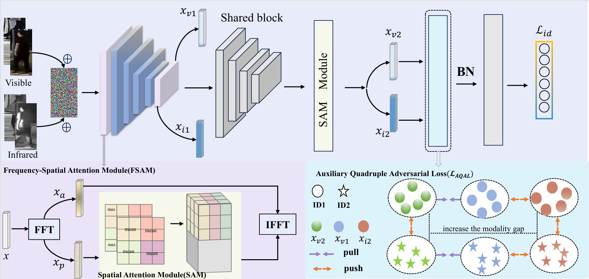

# Feature-Level-Adversarial-Attacks-and-Ranking-Disruption
### This is the code for the nips'24 paper "Feature-Level Adversarial Attacks and Ranking Disruption for Visible-Infrared Person Re-identification." 



### 1. Baseline.

Pytorch Code of AGW method [1] for Cross-Modality Person Re-Identification (Visible Thermal Re-ID).

### 2. Training.
  Train a model by
  ```bash
python train.py --dataset sysu --lr 0.1 --method agw --gpu 1
  ```

  - `--dataset`: which dataset "sysu" or "regdb".

  - `--lr`: initial learning rate.
  
  -  `--method`: method to run or baseline.
  
  - `--gpu`:  which gpu to run.

The training log will be saved in `log/" dataset_name"+ log`. Model will be saved in `save_model/`.

### 3. Testing.

Test a model on SYSU-MM01 or RegDB dataset by 
  ```bash
python test.py --mode all --resume 'model_path' --gpu 1 --dataset sysu
  ```
  - `--dataset`: which dataset "sysu" or "regdb".
  - `--mode`: "all" or "indoor" all search or indoor search (only for sysu dataset).
  - `--trial`: testing trial (only for RegDB dataset).
  - `--resume`: the saved model path.
  - `--gpu`:  which gpu to run.
## 4. Citation

Kindly include a reference to this paper in your publications if it helps your research:

```
@inproceedings{
yang2024featurelevel,
title={Feature-Level Adversarial Attacks and Ranking Disruption for Visible-Infrared Person Re-identification},
author={Xi Yang and Huanling Liu and De Cheng and Nannan Wang and Xinbo Gao},
booktitle={The Thirty-eighth Annual Conference on Neural Information Processing Systems},
year={2024},
url={https://openreview.net/forum?id=RaNct2xkyI}
}
```


### 5. Refrence

[1] M. Ye, J. Shen, G. Lin, T. Xiang, L. Shao, and S. C., Hoi.  Deep learning for person re-identification: A survey and outlook. IEEE Transactions on Pattern Analysis and Machine Intelligence (TPAMI), 2020.


